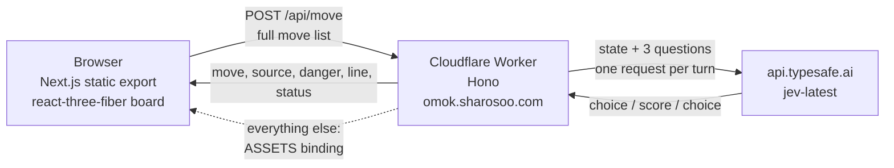

# jev-omok — design

A 3D gomoku (오목) game for `omok.sharosoo.com`. The human plays black and moves
first by clicking an intersection; an AI plays white. The AI's move is chosen by
a deterministic engine for everything the board can prove, and by TypeSafe AI's
**Jev** System One model for everything it cannot.

Every number in this document was measured against the live API and the running
Worker, not estimated. The probe transcripts are reproducible with the scripts
described in [Measurements](#measurements).

---

## 1. What Jev is, and what that forces the architecture to be

Jev is not a chat model. It takes a `state` plus a map of typed questions and
returns typed answers with calibrated probabilities — `choice`, `score`, `noul`
— and nothing else ([API reference](https://docs.typesafe.ai/api.md)).

```
POST https://api.typesafe.ai/v1/systemone
Authorization: Bearer <TYPESAFE_API_KEY>
{ "state": <string|object|array>, "model": "jev-latest", "questions": { … } }
```

That shape is a good fit for gomoku only if the code does the searching. A
`choice` question cannot enumerate a game tree; it can compare options that the
code has already generated and annotated. So the division is:

| Owned by code (deterministic, provable) | Owned by Jev (judgment) |
| --- | --- |
| Legality, win detection, 33 금수 | Which of ~12 non-forced candidates to play |
| Shape classification (five / open four / four / open three / closed three) | How dangerous the position feels (`score`, 0–3) |
| Taking a five, blocking a five, open four, four | What the AI says to the player (`choice` over line ids) |
| Fork detection and fork-point denial | — |
| VCF (victory by continuous four) search | — |

The rule that drove most of the design: **anything computable from the board is
computed, never asked.** A probe that asked Jev "did the human miss an urgent
threat?" returned 0.84 when the human ignored an open three and 0.67 when the
human blocked it correctly — separating, but far too weak to act on, while the
same question is exactly decidable in code. That question was deleted.

---

## 2. Deployment shape



**Next.js `output: "export"` + Workers Static Assets + one Hono Worker.** Not
`@opennextjs/cloudflare`:

- The board is a client-side WebGL scene. There is no server rendering to gain,
  and SSR on Workers costs a 2–10 MB bundle and a 50–200 ms cold start, versus a
  sub-50 KB API Worker and CDN-cached assets.
- `next-on-pages` is archived (September 2025) and has no Next 15/16 support.
- Cloudflare's current recommendation for full-stack apps is Workers Static
  Assets ([docs](https://developers.cloudflare.com/workers/static-assets/)).
- The API key never reaches the client: it exists only in the Worker isolate as
  `c.env.TYPESAFE_API_KEY`.

`run_worker_first` is scoped to `["/api/*"]`, so static requests are served by
the CDN and never spend Worker CPU.

### Why the free plan is enough

| Limit | Free | Our usage |
| --- | --- | --- |
| CPU per request | 10 ms | engine 0.4–1.0 ms measured; `await fetch` does not count as CPU |
| Subrequests | 50 | 1 (the Jev call) |
| Wall clock | no hard limit | 250–900 ms typical turn |
| Secrets | 64 | 1 |

Session state lives in the browser (`localStorage`), and the Worker is
stateless: each request carries the full move list and the Worker replays and
validates it. KV is disqualified for turn state (1,000 writes/day free = ~33
games), Durable Objects are unnecessary without multiplayer, and D1 is only
worth adding if completed-game archiving is ever wanted.

---

## 3. Rules

| Mode | Board | Win | Forbidden | Default |
| --- | --- | --- | --- | --- |
| `freestyle` | 15×15 | five **or more** in a row | none | ✅ |
| `double_three_ban` | 15×15 | five or more | a move making two open threes at once, **both colours** | option |

Free-style 15×15 gomoku is a proven first-player win (Allis, *Go-Moku Solved by
New Search Techniques*, AAAI 1993; thesis 1994). That is deliberately left in
place: the human moves first, so the theoretical edge belongs to the player, and
difficulty is tuned with blunder gates instead of taking away the human's
advantage.

Renju's asymmetric restrictions (black barred from 33/44/overline while white is
not) are the competitive standard but confuse casual players, so they are out of
scope. `double_three_ban` is the Korean casual rule most players already know,
applied symmetrically. The engine takes `RuleSet` as a parameter everywhere, so
adding Renju later is a new `RuleSet` value plus one predicate in `rules.ts`, not
a refactor.

---

## 4. The decision pipeline

`src/engine/decide.ts`, in order. Each step returns immediately if it fires.

1. **Opening book** — centre if empty, centre-steal if black opened off-centre,
   otherwise a randomised adjacent reply to a centre opening. Stops after
   white's first stone; there is no fake 26-opening book.
2. **Own five** → play it.
3. **Opponent five** → block it.
4. **Own open four** → play it (unanswerable).
5. **Opponent open four** → block it.
6. **Opponent four** → block it. *Before* our own fork: a four wins in one move,
   a fork wins in two.
7. **Own fork** (two threats at once) → play it.
8. **Opponent fork point** → take it away.
9. **VCF search** (`src/engine/vcf.ts`) → play the forced win if one exists.
10. **Narrow, then judge.** If the opponent has an open three, the candidate pool
    is reduced to moves that actually answer it — blocks, fork denials, our own
    fours, our own forks — and the choice among them goes to Jev.
11. **Jev** picks among the top ~12 candidates; or the static evaluator picks if
    Jev is disabled, unconfigured, or fails.

### The bug this ordering encodes

A plain forced ladder that blocks the opponent's open three on sight plays a
purely reactive game. Measured, against a greedy baseline opponent:

| Ladder | Result | AI's moves |
| --- | --- | --- |
| blocks open threes immediately | no winner in 81 plies | 34 blocks, 3 judged, **0 attacks** |
| narrows to answers, lets Jev choose | **AI wins in 28 plies** (H10–I9–J8–K7–L6) | 3 judged opening moves, 8 blocks, 3 forcing wins |

Blocking is one legal answer to a three; a four of our own is another, and it
seizes the tempo. Step 10 exists so the engine can find that.

### Search

Steps 10-11 alone lost half the games against a club-level baseline (the same
forced ladder plus a greedy static pick), always to a five that had been visible
for several moves. A one-ply evaluation cannot tell blocking an open three from
blocking the end that *holds* — both read as "denies an open three" — and Jev's
confidence on quiet moves sits near 0.3, so the choice was close to a coin flip.

So an alpha-beta search now rates the pool, and the judgment layer only ever
sees moves the search considers near-equal. A style choice can no longer cost
material.

Two implementation decisions keep it inside the CPU budget, both measured:

| Naive | Cost | Fixed by | Cost |
| --- | --- | --- | --- |
| `analyzePoints` per node | 0.59 ms/node → **1377 ms** at depth 6 | reuse the root's ordered candidate list, add only forced replies | — |
| full-board evaluation per leaf | 0.032 ms/leaf | carry the score incrementally; a placement can only change the windows through it | **2.1 ms/turn** at depth 6 |

Measured per turn on a crowded position: medium (depth 4) 1.8 ms, hard (depth 6)
2.1 ms, master (depth 6, wider) 2.1 ms. The free plan allows 10 ms.

Three bugs the tests and the game runs caught, worth keeping in mind:

- **Selection ignored the search.** Sampling weights came from the static score,
  so `hard` kept choosing a statically pretty move the search had rated worse
  (0-3 over six games). Weights now come from rank.
- **Counter-wins were missing from forced nodes.** When the opponent made a
  four, the pool held only the covering points, so a position where we could
  complete five was scored as a loss. The error compounded with depth: depth 8
  went 0-4 against a baseline depth 6 beat 3-0.
- **Depth past 6 makes this scheme worse, not better.** The tree reuses the root
  candidate list, and by ply 8 the refutations that matter are points the root
  never generated. Per-node regeneration would cost 0.59 ms × 30k nodes, so
  depth is capped at 6 and master spends its budget on width instead.

Result over six games per level against the baseline: master 3-0-3, hard 3-2-1,
medium 1-1-4. Before the search: roughly half of all games lost at every level.

---

## 5. The Jev request

One request per turn carries three questions. Batching is the documented pattern
— questions run in parallel and a second question costs tokens, not latency.

### `move` — `choice` over candidate coordinates

Each option is an object, not a bare coordinate:

```json
"K8": {
  "if_i_play_here": "I form: 1 four + 1 open three",
  "my_double_threat": "yes - two separate threats at once, which cannot both be answered",
  "if_opponent_plays_here_instead": "opponent would form: 1 open three",
  "opponent_double_threat_here": "no"
}
```

`instructions` carries the task, the playing style, and an explicit priority
order (five > survive > own fork > deny fork > strongest threat).

**The fork flags are load-bearing.** The first annotation exposed only the
strongest single-line shape per point. On the position where the opponent's
double-three point had to be taken, that annotation picked a quiet building move
in 3/3 trials, because nothing in the option text said the point was a fork.
Adding `my_double_threat` / `opponent_double_threat_here` fixed it to 3/3
correct. The model trusts the annotation, so the annotation must mention every
fact the priority order refers to.

### `danger` — `score` over four levels

Safe / Watchful / Urgent / Losing. Drives the HUD meter. Verified monotone and
repeatable:

| Position | Runs |
| --- | --- |
| black has a four | 2.10 / 2.09 / 2.09 |
| black has an open three | 1.36 / 1.42 / 1.37 |
| black has nothing | 0.05 / 0.04 / 0.05 |

Spread across runs is ±0.03 on unambiguous positions, so a threshold at 1.5 and
2.5 is safe. The code also computes its own `danger` for the turns where Jev is
not consulted, on the same 0–3 scale.

### `line` — `choice` over line ids

Jev never writes Korean. It picks one of `calm_open`, `respect_human`,
`warn_own_threat`, `taunt_strong`, `panic`; the Worker looks the id up in
`src/lib/lines.ts` and picks one of the pre-written variants at random.
Terminal lines (`ai_wins`, `human_wins`, `draw`) are decided by code, because
the result is a fact.

### Measured accuracy

7 forced positions with a known correct answer, candidate order shuffled per
trial, `jev-latest`:

| Annotation | K | Correct |
| --- | --- | --- |
| bare ASCII board + coordinate list | 12 | 18/21 |
| shape annotation, no fork flags | 12 | 18/21 |
| shape + fork annotation | 12 | **20/21** |
| shape + fork annotation | 30 | 12/14 |

Two findings shaped the design. First, the bare board failed the position where
the AI had to *win* instead of blocking the opponent's four — it blocked, 0/3.
That class of error is why forced tactics never reach Jev in production. Second,
accuracy drops at K=30, so the candidate list is truncated to 12.

Cost and latency per turn: **~2.2k input / ~240 output tokens, 250–900 ms**
(observed 236–929 ms over ~90 live calls).

---

## 6. Difficulty

Weakening by searching less still blocks every four, which feels robotic.
Weakening by *sometimes not noticing* plays like a human beginner, so the knobs
are probabilistic gates plus a temperature on Jev's own distribution.

| | beginner | easy | medium | hard | master |
| --- | --- | --- | --- | --- | --- |
| candidates (K) | 5 | 7 | 10 | 12 | 12 |
| VCF depth | 0 | 0 | 4 | 8 | 12 |
| takes a five | 85% | 95% | 100% | 100% | 100% |
| blocks a four | 65% | 85% | 98% | 100% | 100% |
| answers a three | 40% | 70% | 92% | 100% | 100% |
| temperature | 1.5 | 0.9 | 0.45 | 0.15 | 0 |
| blunder rate | 20% | 8% | 2% | 0% | 0% |
| uses Jev | no | yes | yes | yes | yes |

Temperature reshapes Jev's returned `probabilities` rather than re-prompting, so
a weaker level costs the same request. Observed on one position: raw
`J9:0.60 G11:0.12 M12:0.09 …` becomes `J9:0.92` at T=0.5 and `J9:0.31 G11:0.14`
at T=2.0.

`beginner` skips the Jev call entirely — it is the one level where paying for a
judgment would be wasted.

---

## 7. Shape classification

`src/engine/patterns.ts` does not use a pattern-string table. For a point and a
direction it counts **five-completion points**:

- after placing, ≥2 distinct points complete five → open four
- exactly 1 → four
- else, if some empty point would turn the line into an open four → open three
- else, if some empty point would turn it into a four → closed three

This gets broken shapes (`OO_OO`, `O_OOO`, `_O_OO_`) right by construction,
which a hand-written regex table repeatedly did not during the probe phase. The
quiet-position term is separate: every untouched five-window through the point
contributes (own stones)², which is what orders development moves.

Static weights: five 1e6, open four 1e5, four 1e4, open three 8e3, closed three
1e3, own threats ×1.1 for initiative, centre bonus `20 - 2·max(|x-7|,|y-7|)`.

---

## 8. Failure behaviour

| Failure | Behaviour |
| --- | --- |
| Jev HTTP error / malformed answer | static evaluator picks; `source: "engine_fallback"`, reason carries the cause |
| Jev slower than 6 s | aborted, same fallback |
| No `TYPESAFE_API_KEY` bound | Jev is never called; the engine plays alone and the game is still fully playable |
| Client sends an illegal history | 400 `invalid_history` with the offending move index |
| Engine picks an occupied point | 500 `engine_error` — the Worker re-checks the board before answering |
| Human's move already won | `move: null` plus the terminal status; the AI does not answer with a stone |

The client retries once on 5xx/network with 400 ms backoff and a 12 s abort, and
never leaves the turn stuck in `thinking`. A 4xx, a malformed body and an
expired deadline are not retried — the first two cannot be fixed by repeating
the request, and the third already spent the whole budget.

When a turn fails the human's stone stays on the board and `turn` stays with the
AI, so the board is locked but not rolled back; the HUD offers 다시 시도, which
re-issues that same turn. Undo then removes the lone human stone, since an odd
history means the AI never answered.

---

## 9. Measurements

All figures above came from four probe runs against the live API and the local
Worker:

1. **Encoding comparison** — 7 positions × {bare, annotated} × 3 shuffles.
2. **Fork-annotation fix** — same suite, annotation v2, 21 trials.
3. **Candidate-count sweep** — K=12 vs K=30, 28 trials.
4. **Full games** — greedy baseline vs the Worker over HTTP, before and after
   the step-10 change.

The engine's own cost, measured in-process on a 61-stone midgame board:
`candidates()` 0.03 ms, `analyze()` 0.40 ms, forced ladder 0.43 ms, VCF depth 4
0.61 ms, VCF depth 6 0.60 ms. That is the basis for the free-plan CPU claim.
